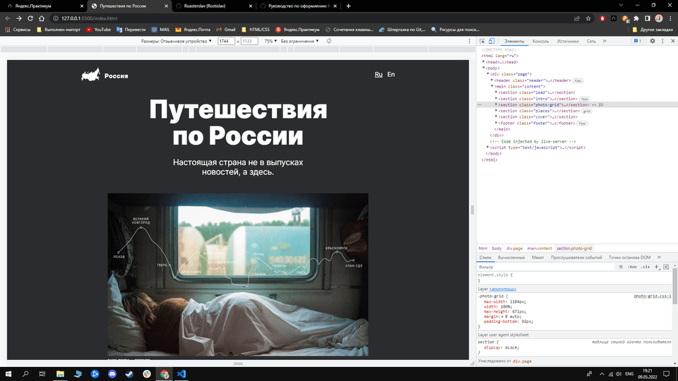
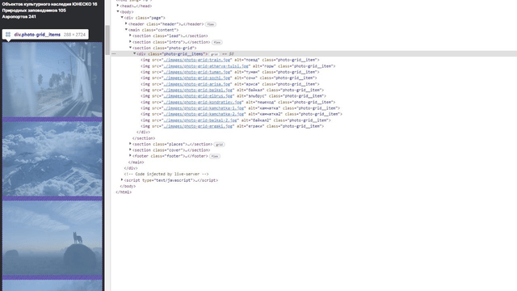
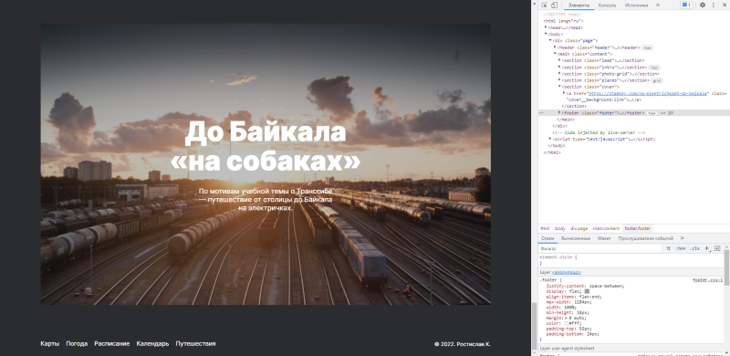
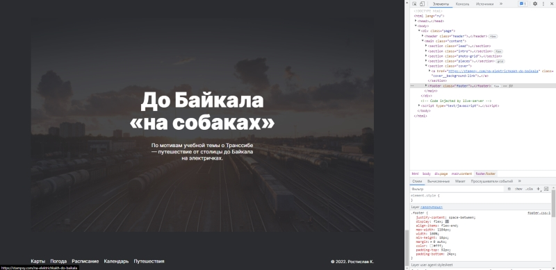

# Проект: Путешествие по России

## Обзор
* Ссылка на готовую страницу
* О проекте
* Макет Figma
* Реализация

### **Ссылка на страницу**

* [Готовая работа](https://roasterslav.github.io/russian-travel/) 

### **Интро**

Реализован учебный проект Яндекс.Практикума о путешествии по России.

После прохождения тренажеров и теории, нам был выдан макет в "Фигме", макет сделан с 
расчетом, что сайт будет адаптивным, поэтому содержит в себе популярные разрешения экранов.

### **Макет**

* [Ссылка на макет в Figma](https://www.figma.com/file/5S2WSbEFL6awjVWJ0NWL8Q/Sprint-3_-Russia-_-desktop-mobile?node-id=28503%3A0)

### **Реализация**

* Адаптивная вёрстка

Адаптивная вёрстка сделана для разрешений: 
  

* 1280px +
* 1024px 
* 768px 
* 320px 

 

* Grid & @media

Реализованы медиазапросы для Grid элементов для разных разрешений экрана.

 

* Link & hover

Все ссылки в проекте работают и ведут на актуальные сайты.

 

Реализованы opacity через псевдоэлемент after, настроен hover

